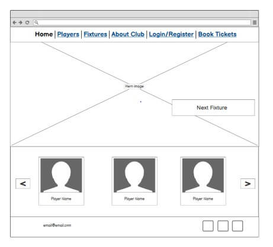
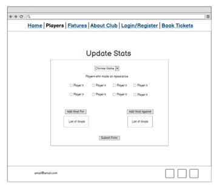
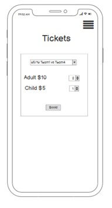
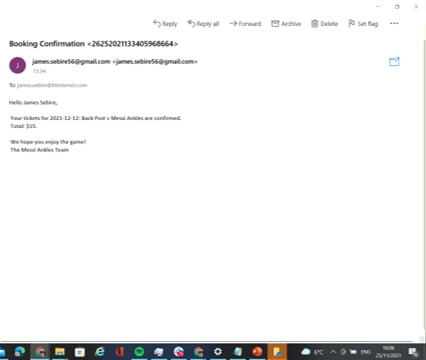

# Messi Ankles Website


## User Stories

### Owner Goals:

1. Be able to save data about games and players.
2. Have an easily accessible and easy to use ticket system.
3. Sell tickets.

### Customer Goals:

1. Be able to book tickets.
2. Be able to see the dates and times of games.
3. See player stats.
4. Not have to put in my details every time I pay for tickets.
5. Not have to create an account to use the service.
6. See my previously booked tickets.
7. Be able to view the scores of previous games.

### My Goals:

1. Have a responsive website.
2. Player carousel on home page.
3. Base functionality e.g. all CRUD operations.
4. Automatic email on booking. 


## UX

### Design:
* The colour scheme is going to be yellow and black as those are the club colours.
* I want the website to be modern, have a robust feel about it, so using sharp lines and blocked structure.


### Wire Frames:

* Site Structure

    

    The website structure is pretty straightforward. All pages are accessible through the nav bar and then editing players is linked from the player profiles page and other stats are updated through an update stats admin page.

    Changes in final design:

    * Pretty quickly I decided to abort the idea of a global stats editing page. This is because it made more sense to edit stats individually which could be achieved, similar to the player profiles, by going into individual fixtures from the fixture list. Also player stats are dynamically gotten by querying the goal and fixture objects, rather than saving them to the player object. Therefore there is no need for a player stats page to edit.

    * I also added a table page that shows a league table based on fixtures in the database. This will allow a user to see where any team is placed in the league, which is useful information. Plus it represents all the fixture data clearly.

    * The final version of the 'My Profile' combines the profile page and the my orders page. With this information all in one place it means the user doesn't have to switch pages.


* Home Page

    #### Desktop

    

    The home screen, being the first page the user sees, has a photogrph of the team in full kit. This highlights what the website represents. On the hero image it gives the user the next fixture, as that is what a returning user is most likley going to want to know when visiting the site.

    At the bottom is a player carousel that links to player profiles and show more indeth stats about the players. It shows three cards at once because it balances out the page better than one or two and doesn't overcrowd the space with 4 on smaller devices where you would still have the larger carousel. 

    Changes in final design:

    * The final home page is very similar to the original wire frame with the addition of a book tickets button under the fixture tab on the hero image. One of the owner goals was to make the  tickets page easily accessible and having a button meets this criteria


    #### Mobile

    

    The mobile design shortens the carousel to one player image at a time to cater to the smaller screen size. Also, the fixtures tab has been taken off the hero image so it doesn't block it on the smaller sized screen.

    Changes in final design:

    * The design and basic layout of the page has been consistent throughout development of having the block for the hero image and then a block for the player carousel. However, in the final design, I have added the fixtures and booking tickets button above the hero image, as these were important features for users to have access to. Also it doesn't block off the hero image as it would, if it were layered ontop. I did experiment with having different numbers of player pictures at the bottom, but 2 looked unbalanced and at 3 the pictures looked too small.


* Squad Page
    
    #### Desktop

    

    The goal of the squad page is just to show all the players and a link to their profile page.

    Changes in final design:

    * In the final design the players are split in to their positions and because of the use of Bootstrap columns it gives off the formation the team plays on the field which looks good.

    * Also in the final design I added the player number to the player card because it looks good and gives that extra bit of info to identify a player.


    #### Mobile

    

    Mobile is the same as desktop it's just one player card per row so as not to condence any elements on the page.

    Changes in final design:

    * The only change on mobile is the headers for the player positions to separate out the players.


* Player Profile


    #### Desktop

    

    The layout for the player profile was to have half the screen a picture of the player and then the other half displaying information about the player such as goals, assists and clean sheets.

    Changes in final design:

    * Instead of having the stats in a block of text they are individually separated out into their own tabs coming off of the player picture. The tabs are the same shape as the nav bar and follows the style of how info is blocked as on the home page, keeping the styling consistent throughout the website.

    * The final version also included an edit button for admin to edit the player and a delete button at the bottom of the page.


    #### Mobile

    

    The mobile view has the same components as the desktop, other than the layout is vertical instead of horizontal to fit it all on the page.

    Changes in final design:

    * The style of the stat tabs used in the final desktop view are the same in mobile. However, they have been moved below the picture and come out from the left hand side of the page, rather than the player image.


* Fixtures Page


    #### Desktop

    

    The Fixtures page consists of  table with both previouse and future fixtures. Each fixture displays the time and date of the fixture, the score if it had been played and the teams.

    Changes in final design:
    
    * The final design included an add fixture button at the bottom. Additionally along the right hand side a column for an edit fixture button to allow the updating of individual fixture.


    #### Mobile

    

    Displays the same as the desktop view just slimmer to fit the screen size.

    Changes in final design:

    * In the final design it was a bit too much content to fit on a small screen, so I removed the date and time as that was the least relevant information to the fixture. For the admin the edit fixture button is in the row below.


* Edit Fixture

    #### Desktop

    

    The update stats page is a form that lets you manipulate fixture, objects and data. At the top is dropdown that let's you select the fixture you want to edit. Then a list of messi ankles players which you can select to show if they made an appearance. Underneath is a button to add a goal and list of all the goals in the fixture. There is one for the home team and one for the away team, and then a submit at the bottom. The top goal for this page was functionality.


    Changes in final design:

    * Due to the way the models were set up there was no need for the appearances check boxes.
    Also there is only one add goal button, not two separate buttons, although I did keep the two separate tables.

    * The fixture also now includes the time and date which are fields that are editable in a form beneath the goal tables. Also there is a checkbox for whether the game has been played yet.


    #### Mobile

    

    The mobile version of the page is just the same as desktop but scaled down..

    Changes in final design:

    * Again due to smaller screen size and to keep the ease of use, it was better to vertically stack the form inputs rather than horizontally.

    #### Add Goal Form

    

    The add goal form also was just designed for functionality. It has a dropdown menu for the players scoring and assisting and an input for the time of goal.

    Changes in final design:

    * In the final design there is only one form for both teams and a select box at the top to choose the team. This is instead of two buttons, and allows for quicker change if the wrong team is chosen. I didn't include time of goal as a data included in the goal as I didn't have anywhere I was going to display it, however if I make a more indepth fixtures page where you can look at each individual fixture I could add it in then.


* Book Tickets


    #### Desktop
    

    The book tickets page is meant to be a simple process, but also inviting as you want the user to be excited when they are booking tickets for the match. So on the left is a picture to make the page more interesting and on the right the form to fill out what tickets the user wants.

    Changes in final design:

    * Currently don't have an image that fits the tickets page but do want to add one.

    * There's no choice for child tickets just one standard price for all. This is because there's no way to check the users age without entering a valid id which is offputting and makes booking tickets harder. You don't want to be turning away customers on game day because they have the wrong ticket. The total price value is also shown above the number of tickets.

    #### Mobile
    

    The mobile tickets page doesn't have a picture due to the lack of space.

    Changes in final design:

    * Same as desktop small change to whats being inputed into the form. 


* Checkout

    #### Desktop
    

    The checkout page is designed for ease of inputting card info. It shows a small form with the required info to send them a ticket by email, also an order confirmation tab so they can check what they are ordering before clicking buy.

    Changes in final design:

    * In the final design the order confirmation is above the checkout form. It is only 3 lines of info, the fixture the number of tickets and the price, so you don't need to take up half the page's space. It is on top because logically you check it before you confirm payment.

    #### Mobile
    

    Mobile includes the same content but just vertically stacked so that nothing is condensed.

    Changes in final design:

    * Only change is order confirmation is on top because logically you check it before you confirm payment.

## Features
### General UI:

* A dynamically changing nav bar that looks good across all devices, on mobile has an off canvas side menu that displays all the same tabs that would be shown on desktop.

* Nav bar is styled in a trapezoid shape so it lines up nicely with the right hand side of the page and keeps that sharp lined design I'm aiming for for.

* Footer has email for contact info and links to social accounts so that the user can easily find out more about us or contact us.

* Toasts popup in the bottom right displaying any message the server has for the user. The toasts are color coded depending on the type of message. This gives instant feedback to the user about any valuable information like CRUD operations.

    | Message | Color  |
    | ------- | ------ |
    | Success | Green  |
    | Warning | Yellow |
    | Info    | Blue   |
    | Error   | Red    |

### Home Page:

* The hero image is displayed on the home page, and therefore users can instantly see the whole team and recognise that this is a website about a sports team.

* The Fixtures tab on the Home page is visible as soon as you load the page. This has the most important information, such as the teams next fixture and also a link to buy tickets for that fixture.

* A player carousel at the bottom of the page that links to player stats and shows off the team. It is functional on both desktop and mobile. 

### Players Page:

* Each individual player has their own player card with their name and shirt number. The players are sorted into position for user ease of looking through the players and also creates a nice layout for the page.

* Each card links to the individual players profile with stats about the player that the user can read and also keep a record for the club.

* For admins there is the ability to add players.

### Players Profile Page:

* The profile page has a picture of the player and the stats of the player. The stats are generated through functions making sure that each goal or assist is linked to an instance of the Goal model saved in the database. This is the same for clean sheets and appearances, with the Fixtures model. This design means that when you create a goal you don't have to manually update player stats as well.

* The page is also viewable across all screen sizes and will automatically change layout if needed.

* Admin can edit the players name, number and position, but is unable to change goals assists, appearances or clean sheets without creating the Fixture or Goal instance to go along with it..

* Admin can also delete players with a delete player button at the bottom of the screen.

* There’s also a back button to take you back to the players page.

### Fixtures Page:

* The fixtures table shows all fixtures that are in the database. This includes the date and time of the fixture, the home and away team and also the score if the game has been played. The fixtures are displayed in date order.

* For admin users there is an edit fixture button next to each fixture to make it obvious which fixture you’re editing and an add fixture button at the bottom of the page.

* The add fixtures form lets the admin input the home team, away team, the date, and time of the fixture. It does not include goals of the fixture or whether the fixture has been played yet because the fixtures should be put up in advance of the match and then you can edit them afterwards to add goals and change the game played status.

* There is also a cancel button to go back in case the admin didn't want to add a fixture.

* The edit fixture page is similar to the add fixture page except it has the option to add goals and change the game played status. The form is already filled out with the info about the fixture that is saved on the data base.

* The add goals form on the edit fixtures form creates instances of goals linked to the currently editing fixture. If the team that is selected to have scored is Messi Ankles, then you also get the option to add a goal scorer and assist maker which will also be saved to the goal object. This then gets displayed in a table underneath the team name which displays all the goals, and a button to delete the goal if it was a mistake.

* If you change teams there would still be goals of the previous teams linked to the fixture so when you change team a popup will appear letting you no what’s going to happen and whether you want to continue or not. if you do want to continue it will delete all goals in the fixture related to that team.

### Table: 

* The table shows the current league table of all the fixtures in the database, it shows the wins draws and losses, total points and number of goals scored by each team.

### Tickets Page:

* The Tickets page has a select input of all the fixtures that haven't been played yet, to buy tickets for, as you don't want people buying tickets for games that have already been played.

* It also has a number input that lets the user purchase as many tickets as they want which then changes a total box on screen, displaying the final price.

* The ticket form will make sure that nothing is empty before you continue onto the checkout page and validate the data being put in.

### Checkout Page:

* The checkout page will display the details of the order for the user to make sure they are correct.

* The checkout form will be prefilled with info if the user is logged in and has the details saved to their profile. If the user is not logged in, they will have to fill out their first and last name and email as well as their card info.

* The card info is automatically validated by stripe, before being sent off to be processed.

* If the card info is invalid no tickets will be created and a message will appear for the user telling them the specific error, e.g. insufficient funds or card not authenticated.

* If the checkout is complete then the user will be taken to a success page with their order information and an email sent to their email account.

* The checkout page also has a loading sign whilst waiting for stripe to respond.

### Profile Page:

* The profile page has a list of the users’ orders

* There is also a small form to save info to prefill the checkout form.

### Login/ Logout/ Create an Account Page:

* Login/ Create an account page have links to each other to easily switch if user does or doesn't have an account.

* Logout double checks to make sure if you do want to logout to avoid mistakes.

## Technologies Used

### Languages Used:

* HTML
* Python
* CSS
* JavaScript

### Frameworks, Libraries and Programs Used:

1. Django
    * Django is the framework I used to create this project. Django’s extra packages I used are:
        * django-allauth - Allauth is an integrated set of Django applications addressing authentication, registration, account management as well as 3rd party (social) account authentication.
        * django-crispy-forms - Used to automatically style forms created with Django templates.

2. Bootstrap
    * Bootstrap has been used to style the whole app and provide certain components like the carousel.
3. Heroku
    * Heroku is the platform I have used to host the Messi Ankles app.
        * gunicorn - Used to server the Django app.
4. Heroku Postgres
    * Heroku Postgres is what I have used to store the database on when the website is on Heroku. Some packages to set up the Postgres database and connect to Django.
        * dj_databases_url
        * psycopg2-binary
5. Amazon Web Services
    * Amazon web services is how I store my static files, specifically using s3 buckets and IAM to set it up. Some packages I need to connect Django and AWS.
        * boto3
        * django-storages

6. Stripe
    * Used to handle the payment and a checkout system for purchasing tickets.
7. Google Fonts
    * Styles the fonts throughout the website.
8. FontAwesome
    * Provides logos and icons in the app.
9. Git/ Gitpod
    * GitPod is the development enviroment I used and I used Git for version controll.
10. GitHub
    * GitHub is where all the commits of the repository are kept. 
11. Balsamiq
    * Balsamiq was used to create wireframes for the project.

## Testing

### Testing User Goals:

* Have a website that tells people about the club.

* "Be able to save data about games and players."

    The database I have created has models for Teams, Players, Fixtures, Goals, Tickets, and Users. All of these have a table where they are saved to after being created.
    The Teams and Players have been loaded in through fixtures that I created using [Mockaroo](https://www.mockaroo.com/) which generates random json files with custom fields you put in.
    Everything else is created within the app using Django’s models and `.save()` method.


    fixtures/models.py
    ```
    class Fixture(models.Model):

    home_team = models.ForeignKey(Team, on_delete=models.CASCADE, related_name='home_team', null=False, blank=False)
    away_team = models.ForeignKey(Team, on_delete=models.CASCADE, related_name='away_team', null=False, blank=False)
    date = models.DateField()
    time = models.TimeField()
    game_played = models.BooleanField(default=False, null=False, blank=False)

    def __str__(self):
        return f'{self.date}: {self.home_team} v {self.away_team}'

    def home_team_goals(self):
        goals = Goal.objects.filter(fixture=self, team=self.home_team)
        return goals

    def away_team_goals(self):
        goals = Goal.objects.filter(fixture=self, team=self.away_team)
        return goals
    ```

    This is my fixtures model, the data saved to it are the home team, away team, date of the fixture, time of the fixture and whether or not the game has been played. The goals in the fixture are class methods, because it means that when you want to look up the number of goals in the fixture each goal is linked with a goal object. This will decrease the amount of errors across all tables with linked data such as goals, assists or clean sheets as there is no physical data linked to the objects.


    fixtures/models.py
    ```
    class Goal(models.Model):

    goal_id = models.CharField(max_length=100, primary_key=True)
    team = models.ForeignKey(Team, on_delete=models.CASCADE, null=False, blank=False, related_name='team_goals')
    goal_scorer = models.ForeignKey(Player, on_delete=models.CASCADE, related_name='goals' , null=True, blank=True)
    assist_maker = models.ForeignKey(Player, on_delete=models.CASCADE, related_name='assists', null=True, blank=True)
    fixture = models.ForeignKey(Fixture, on_delete=models.CASCADE, null=False, blank=False)

    def __str__(self):
        return f'Goal: {self.team}, {self.fixture}'

    ``` 

    This is my Goal class it contains the id of the goal, the team which scored, the goal scorer, assist maker and which fixture the goal was scored in. With all this information linked to the goal, it makes it easy to build queries about the goals in certain fixtures or by certain teams or even by players throughout the app.


    players/models.py

    ```
    class Player(models.Model):

        name = models.CharField(max_length=254)
        number = models.IntegerField(null=False)
        position = models.CharField(max_length=15)
        team = models.ForeignKey(Team, on_delete=models.CASCADE, null=False, blank=False, related_name='team_players')
        image_url = models.CharField(
            max_length=100,
            null=True,
            blank=True
            )

        def __str__(self):
            return str(self.name)

        def appearances(self):
            appearances = 0
            fixtures = self.team.home_team.all() | self.team.away_team.all()
            for fixture in fixtures:
                if fixture.game_played == True:
                    appearances += 1

            return appearances

        def clean_sheets(self):
            clean_sheets = 0
            home_fixtures = self.team.home_team.all()
            for fixture in home_fixtures:
                if fixture.game_played == True:
                    if len(fixture.away_team_goals()) == 0:
                        clean_sheets += 1

            away_fixtures = self.team.away_team.all()
            for fixture in away_fixtures:
                if fixture.game_played == True:
                    if len(fixture.home_team_goals()) == 0:
                        clean_sheets += 1

            return clean_sheets

    ```

    This is my Player class. It saves the name of the player, their shirt number, their position, the team they play for and the URL for their image that I use on the app.
    Data about the players performance is retrieved through the class methods for the same reason as the Fixture class because it means mistakes are less likely and keeps things consistent across the database. You can edit the features of the Messi Ankles players, such as shirt number or position or name through the app. Admins have access via an edit player button to change the values of these fields. The players that belong to other teams I don't think need the ability to be changed in the app as it is a Messi Ankles website,  However if you do wish you can edit them through the Django admin. If you wish to change which team the website is for just change which team is being filtered in the queries and you will be able to access these other players but as it is filler data that is not directly related to the users of the website there’s no need to access them through the app.

    Here is the method of how to save fixtures and goals:

    1. Go to the fixtures tab and at the bottom click add fixture and fill out the form and click add fixture.

        

    2. You can then edit the details and click update player.

        

    3. Click add goal and then fill out the team, goal scorer and assist maker of the goal and click add goal.

        

    4. This has saved the goal and you will be able to see it in the edit fixtures view.

        

    5. You can then see that it has been changed in the admin view too.

        


    Here is how you edit a player:

    1. Go to the players tab and then click on the player you want to edit.

        

    2. Then you can edit what you want and click update player.

        

    3. You can then see the changes in the player view.

        

    4. Here are the changes in the admin view.

        

*   "Have an easily accessible and easy to use ticket system."

    "Not have to put in my details every time I pay for tickets."

    "Not have to create an account to use the service."

    When creating the ticket system, I implemented 'easy to use' by making it a minimum two-step process. First choose the ticket and then then checkout. For extra ease you can create an account that saves your info to make checking out quicker. This is not necessary to purchase a ticket for users who "don't want to create an account". To make the tickets 'easily accessible' across all devices the tickets button is directly visible in the nav bar and also visible through a banner on the home page when you first load the webpage.

    Here is what the navbar and home page look like across different pages:

    Desktop

    

    Tablet

    

    Mobile

    

    Here’s how to book tickets:
    
    1. Click on the tickets page and fill out what tickets and how many you want.

        

    2. Fill out your details, if you have your profile details saved it will be prefilled for you and you just have to enter your card details otherwise just enter your name, email and card info.

        

    3. Click checkout and if your card is authorised, you will be taken to the success page. and sent a booking confirmation email.

        
        

    4. Here is the admin view of the ticket object. If the user had no account, the ticket holder field would be empty.

        

*   "Sell tickets"
    "Be able to buy tickets."

    The ticket backend works completley with stripe. I tested the checkout with all three of stipes payment cards.
    The succcessful payment is made and a ticket object is created.
    The Failed payment stops any payment going through and no ticket is created.
    The requires authentication showed a popup to authenticate and then succeded or failed depending on weather the card was authenticated or not.


* "See my previously booked tickets."

    In the profiles app there is a list of your previously bought tickets with the ticket id, price, fixture and number of tickets purchased viewable to the user.
    Currently it's limited to 5 tickets, so the page isn't over filled, but in the future I’m going to add a show more button/ the ability to search and scroll through all the previous bookings.

    

    *   "Be able to see the dates and times of games."
    "Be able to view the scores of previous games."


    On the fixtures page you can see the date and the time of all the fixtures in the first column  on the left. Also on the front page is the date and time of the next fixture.

    The previouse scores of matches are shown on the fixtures table at the top in date order.

    


### My Goals:

* "Have a responsive website."

    All pages have been tested across desktop, iPhone 7, iPhone 11, Samsung Galaxy S20, laptop, and also in the browsers development mode where you can change the screen size. All of them function and are styled corectly.

* "Player carousel on home page."

    The Bootstrap carousel is a great feature of the home page it looks goood and works on desktop tablet and mobile. 

* "Base functionality e.g. creating, editing and deleting data works without any problems."

    I have tested creating fixtures and tickets and it all works, all the form validation stops empty forms being submitted and invalid data being entered.

    Editing fixtures also has been tested thouroughly. All the form validation works and stops invalid info being entered. I had a bug when changing teams, go to the known bugs section for more info (now fixed). Deleting fixtures also works completly and when you delete a fixture it deletes all goals within the fixture too.

    All creating and deleting goal functions have been tested thoroughly. Since there is such little information needing input into goals, it's quicker to just delete the goal object and make a new one.

    All player data functions work aswell. I have tested creating editing and deleting players and all work without any problems.

    Here is how you add and delete players.

    1. Click on the players tab and scroll to the bottom and click on add player.

        

    2. Fill out the players form and click add player.

        
    
    3. The player is now created, because this player is part of Messi Ankles their player card is shown if it was another team it wouldn't.

        

    4. This player doesn't have an image but in the future i would like to add the ability to add this from here for now it will have to be added through AWS.
        You can now delete this player by clicking the delet button.

        
        

* "Sending an automatic email on ticket bookings."

    The user recieves an email when creating a booking and confirms all the details of the booking for the user. I used Djangos email module to send the email.

    tickets/views.py
    ```
    send_mail(
        f'Booking Confirmation <{ticket.ticket_id}>',
        f'Hello {full_name},\n\n Your tickets for {str(ticket.fixture)} are confirmed.\n Total: ${ticket.price}.\n\n We hope you enjoy the game!\n The Messi Ankles Team',
        settings.DEFAULT_FROM_EMAIL,
        [ticket.email],
        fail_silently=False
    )
    ```

### Futher Tesiting

## Known Bugs

* Changing teams when editing fixtures

    When editing a fixture and you want to change the team it will call the function delete all goals to delete all the goals for that team related to the current fixture. This is so there aren't any goals belonging to teams in that fixture. During the execution of this function the the new team is meant to be saved to the fixture so when the page is rendered again it shows the old team.

    Fixed: I changed where the location of the `location.reload()` so that when the `deleteallgoals()` function responds it reloads rather than reloading after the function was called. The problem was the page was reloading to quickly.

    #### New Code

    edit-fixture.js
    ```
    async function delete_all_team_goals(data){
        let csrftoken = getCookie('csrftoken')
        response = await fetch(`/fixtures/delete_team_goals/`, {
            method: 'POST',
            headers: {
              'Content-Type': 'application/json',
               "X-CSRFToken": csrftoken 
            },
            body: JSON.stringify(data),
            credentials: 'same-origin',
        }).then((data) =>{
            location.reload();
        })
    }
    ```


### Testing validation

* HTML - [W3 validator](https://validator.w3.org/)

    * [Home](https://validator.w3.org/nu/?showsource=yes&doc=https%3A%2F%2Fmessi-ankles.herokuapp.com%2F)
    * [Squad Page](https://validator.w3.org/nu/?showsource=yes&doc=https%3A%2F%2Fmessi-ankles.herokuapp.com%2Fplayers%2F)
    * [Player Profile](https://validator.w3.org/nu/?showsource=yes&doc=https%3A%2F%2Fmessi-ankles.herokuapp.com%2Fplayers%2F6%2F)
    * [Player Edit](https://validator.w3.org/nu/?showsource=yes&doc=https%3A%2F%2Fmessi-ankles.herokuapp.com%2Fplayers%2Fedit%2F6%2F)
    * [Fixture Page](https://validator.w3.org/nu/?showsource=yes&doc=https%3A%2F%2Fmessi-ankles.herokuapp.com%2Ffixtures%2F)
    * [Edit Fixtures](https://validator.w3.org/nu/?showsource=yes&doc=https%3A%2F%2Fmessi-ankles.herokuapp.com%2Ffixtures%2Fedit%2F9%2F)
    * [Add Fixtures](https://validator.w3.org/nu/?showsource=yes&doc=https%3A%2F%2Fmessi-ankles.herokuapp.com%2Ffixtures%2Fadd%2F)
    * [Table](https://validator.w3.org/nu/?showsource=yes&doc=https%3A%2F%2Fmessi-ankles.herokuapp.com%2Fteams%2Ftable%2F)
    * [Profile](https://validator.w3.org/nu/?showsource=yes&doc=https%3A%2F%2Fmessi-ankles.herokuapp.com%2Fprofile%2F)
    * [Logout](https://validator.w3.org/nu/?showsource=yes&doc=https%3A%2F%2Fmessi-ankles.herokuapp.com%2Faccounts%2Flogout%2F)
    * [Login](https://validator.w3.org/nu/?showsource=yes&doc=https%3A%2F%2Fmessi-ankles.herokuapp.com%2Faccounts%2Flogin%2F)
    * [Signup](https://validator.w3.org/nu/?showsource=yes&doc=https%3A%2F%2Fmessi-ankles.herokuapp.com%2Faccounts%2Fsignup%2F)
    * [Tickets](https://validator.w3.org/nu/?showsource=yes&doc=https%3A%2F%2Fmessi-ankles.herokuapp.com%2Ftickets%2F)
    * [Checkout]()


* CSS - [jigsaw W3C](https://jigsaw.w3.org/css-validator/)
    * All of the links include base.css, nav.css, mobile.css and all external css files. All of my css passes the validator the only errors are from the font awesome css. 
    * [home.css](https://jigsaw.w3.org/css-validator/validator?uri=https%3A%2F%2Fmessi-ankles.herokuapp.com%2F&profile=css3svg&usermedium=all&warning=1&vextwarning=&lang=en)
    * [squad.css](https://jigsaw.w3.org/css-validator/validator?uri=https%3A%2F%2Fmessi-ankles.herokuapp.com%2Fplayers%2F&profile=css3svg&usermedium=all&warning=1&vextwarning=&lang=en)
    * [player_profile.css](https://jigsaw.w3.org/css-validator/validator?uri=https%3A%2F%2Fmessi-ankles.herokuapp.com%2Fplayers%2F8%2F&profile=css3svg&usermedium=all&warning=1&vextwarning=&lang=en)
    * [fixture.css](https://jigsaw.w3.org/css-validator/validator?uri=https%3A%2F%2Fmessi-ankles.herokuapp.com%2Ffixtures%2F&profile=css3svg&usermedium=all&warning=1&vextwarning=&lang=en)
    * [table.css](https://jigsaw.w3.org/css-validator/validator?uri=https%3A%2F%2Fmessi-ankles.herokuapp.com%2Fteams%2Ftable%2F&profile=css3svg&usermedium=all&warning=1&vextwarning=&lang=en)
    * [profile.css](https://jigsaw.w3.org/css-validator/validator?uri=https%3A%2F%2Fmessi-ankles.herokuapp.com%2Fprofile%2F&profile=css3svg&usermedium=all&warning=1&vextwarning=&lang=en)
    * [tickets.css](https://jigsaw.w3.org/css-validator/validator?uri=https%3A%2F%2Fmessi-ankles.herokuapp.com%2Ftickets%2F&profile=css3svg&usermedium=all&warning=1&vextwarning=&lang=en)
    * [checkout.css]()


* JavaScript - [jshint](https://jshint.com/)

    * edit-fixtures.js

        

    * carousel.js

        

    * toasts.js

        

    * stripe_element.js

        

    * tickets.js

        


* Python - [PEP8 online](http://pep8online.com/)

    * home/

        

    * fixtures/

        

    * players/

        

    * profiles/

        

    * teams/

        

    * tickets/

        

    * settings/

        


* Lighthouse Testing - google dev tools.

    Desktop Lighthouse test
    


    Mobile Lighthouse test
    

## Future scope/ Ideas

* The ability to search through previous tickets.

* Be able to filter fixtures shown on the fixtures table by Team and date.

* For the league table, currently the fixtures need to be part of my database. In the future it would be good to use an api to get the data off of a central league database that all the teams update. Therefore each website doesn't have to keep a database of all the fixtures and just keep their own, or even just get the ones they need from this central db.

* I would like to have an indicator if a goal is an own goal or not.

* I would like to include more data connected to the fixtures and players. For example, possession, time of goal, tackles made. All to build out a more detailed picture of what has happened in a match or how well a player is performing.

* I would like to add uploading player photos from within the player edit page rather than having to do it manually in the aws bucket.

## Deployment
This is how I deployed my project to GitHub and Heroku and set up Amazon web services.

### GitHub & Heroku:

1. First of all I create a GitHub repository using Code institutes github-full-template on git pod.

2. Then created your base files and install Django using `pip3 install django`. 

3. Then create an env.py file which holds sensitive data that you don't want uploaded to git such as the Database URL and secret key. Then create a .gitignore file and put the env.py file and pycache in so they don't get uploaded to GitHub.

4. Then write in the terminal `git add -a`, `git commit` and then `git push` to push it to your GitHub repository

5. Go to Heroku and login. Then click on create new app, enter a name, and chose a region.

6. Then on the resources tab in the add ons section look up Postgres and chose Heroku Postgres and the free hobby dev plan to go along with it.

7. Then back on GitPod  install  `dj_database_url` and  `psycopg2-binary` using `pip3 install ...` as these are required by Postgres to work.

8. Then use `pip3 freeze > requirements.txt` so that Heroku will install all the apps requirements.

9. Then in settings.py add ```import dj_database_url``` at the top and change

    settings.py
    ```
    DATABASES = {
            'default': {
                'ENGINE': 'django.db.backends.sqlite3',
                'NAME': os.path.join(BASE_DIR, 'db.sqlite3'),
            }
    ```

    into 

    settings.py
    ```
    if 'DATABASE_URL' in os.environ:
        DATABASES = {
            'default': dj_database_url.parse(os.environ.get('DATABASE_URL'))
        }
    else:
        DATABASES = {
            'default': {
                'ENGINE': 'django.db.backends.sqlite3',
                'NAME': os.path.join(BASE_DIR, 'db.sqlite3'),
            }
        }
     ```

     which looks if there’s a database URL in the environment and then if not will use the Django SQLite database.

10. Then on Heroku go to your app settings and select reveal config variables. Then copy the 'DATABASE_URL' variable and set it up in your env.py file.

    env.py
    ```
    import os

    DATABAS_URL = 'your database url goes here'
    ```

11. If you have already made models/ made migrations now would be the time to migrate using `python3 manage.py migrate`. also, if you have fixtures that are located in `appname/fixtures/fixturename.json` then you will want to load data using `python3 manage.py loaddata fixturename`

12. Then you will want to create a super user using `python3 manage.py create superuser` in the terminal.

13. Then back on Heroku go to the deploy tab click on connect with GitHub and add your repository. Then enable automatic deployment so each time you push in git pod it will push to Heroku. 

14. Then click settings then config variables and add SECRET_KEY and make it your Django secret key. and then in the settings.py file change your secret key so it looks like this.

    settings.py
    ```
    SECRET_KEY = os.environ.get('SECRET_KEY', '')
    ```

    and add a new secret key to your env.py file.

    env.py
    ```
    import os

    DATABAS_URL = 'your database url goes here'
    SECRET_KEY = 'your new secret key'
    ```

14. Then run `git add .`, `git commit -m` and `git push` in the terminal to push your repository to Heroku. 


15. Then in the terminal install gunicorn using `pip3 install gunicorn` and `pip3 freeze > requirements.txt`.
 
16. then create a Procfile and put in it 

    Procfile
    ```
    web: gunicorn yourappname.wsgi:application
    ```

    This creates a web dyno and serves the Django app.

17. Then disable collect static by going into your config variables creating a variable calls DISABLE_COLLECTSTAIC and set it to 1.

18. Then in settings.py add the URL of your Heroku app to ALLOWED_HOSTS and also local host so you can still run the test server.

    settings.py
    ```
    ALLOWED_HOSTS = ['your-app.herokuapp.com', 'localhost']
    ```

### AWS

1. Go to https://aws.amazon.com/ and create an account.

2. You will need to enter a credit card number which will get charged if you go over the service limit for this project you will not go over the limit.

3. Go back to https://aws.amazon.com/ and login and go to AWS management console under my account.

4. Search s3 in the services search bar.

5. You want to click on create bucket and give your bucket the name your heroku app and select your closest region. Also untick block all public access and check the box that aknowledges you know that your bucket will be public and then click create

6. Go to the properties tab and turn on static website hosting and fill in the index doceument and error document with index.html and error.html as we will not use them and click save.

7. On the permissions tab go to CORS configuration and paste in 
    ```
    [
      {
          "AllowedHeaders": [
              "Authorization"
          ],
          "AllowedMethods": [
              "GET"
          ],
          "AllowedOrigins": [
              "*"
          ],
          "ExposeHeaders": []
      }
    ]
    ```
    and save it.

8. Go to the bucket policy tab and select policy generator to create a security policy.

9. The policy type will be an S3 bucket policy, in principals put '*',  and in actions select GET object.

10. Go back to the permissions tab and copy the ARN code to paste into the ARN box.

11. Click add statement and then generate policy and copy the policy into the bucket policy editor.

12. Before saving add /* on to the end of the resource key to allow access to all resources in the bucket. Then click save and done.

13. Next go to the access control list tab and set the list objects to everyone.

14. Go to the services menu and look up IAM.

15. First click on groups and create group and call it name it so you know what app it's for e.g. yourappname-manager.

16. Click next step twice as we don’t have a policy to attach to it yet. And then click create group.

17. On the left side menu click policies and create policies. then click on the json tab and click import policy.

18. Search for s3 then click on AmazonS3FullAccess and import it.

19. Next you will want to get your bucket ARN from the bucket policies tab again and paste it twice into the resource section as a list and after the second one adds a '/*' to the end so it selects all.

20. Click on review policy and give it a name and short description to do with your app. and then click create policy.

21. Go back to the group you created. select attach policy, search, and select the policy you just created and attach it.

22. Next you’ll want to add a user so click add user at the top and give the user a name like 'myapp-static-files-user' give them programmatic access and then click next.

23. Add the user to the group and click next through to the end and then create user.

24. You then need to download the csv file which contains the access key you need to give to your Django app.

25. Go over to your Django app and use `pip3 install ...` to install `boto3` and `django-storages`. And freeze them into requirements.txt.

26. In settings add storages into the installed apps.

27. At the bottom of your settings file add

    settings.py
    ```
    if 'USE_AWS' in os.environ:
    # Cache control
    AWS_S3_OBJECT_PARAMETERS = {
        'Expires': 'Thu, 31 Dec 2099 20:00:00 GMT',
        'CacheControl': 'max-age=94608000',
    }

    # Bucket Config
    AWS_STORAGE_BUCKET_NAME = 'your bucket name'
    AWS_S3_REGION_NAME = 'your region'
    AWS_ACCESS_KEY_ID = os.environ.get('AWS_ACCESS_KEY_ID')
    AWS_SECRET_ACCESS_KEY = os.environ.get('AWS_SECRET_ACCESS_KEY')

    #Telling Django where the static files are coming from
    AWS_S3_CUSTOM_DOMAIN = f'{AWS_STORAGE_BUCKET_NAME}.s3.amazonaws.com'

    # This connects to the custom_storages file you will create next to store static and media files.
    STATICFILES_STORAGE = 'custom_storages.StaticStorage'
    STATICFILES_LOCATION = 'static'
    DEFAULT_FILE_STORAGE = 'custom_storages.MediaStorage'
    MEDIAFILES_LOCATION = 'media'

    # Override static and media URLs in production
    STATIC_URL = f'https://{AWS_S3_CUSTOM_DOMAIN}/{STATICFILES_LOCATION}/'
    MEDIA_URL = f'https://{AWS_S3_CUSTOM_DOMAIN}/{MEDIAFILES_LOCATION}/'
    ```

    and add your AWS variables to the env.py file.

28. Add your AWS keys to your config variables on your Heroku app. and remove the DISABLE_COLLECTSTATIC variable as the static files should hopefully go to S3.

29. Next you will want to create a file called custom_storages.py and set it up like this.

    custom_storages.py
    ```
    from django.conf import settings
    from storages.backends.s3boto3 import S3Boto3Storage

    class StaticStorage(S3Boto3Storage):
        location = settings.STATICFILES_LOCATION

    class MediaStorage(S3Boto3Storage):
        location = settings.MEDIAFILES_LOCATION
    
    ```

30. Run `git add .`, `git commit -m` and `git push` in the terminal to push the changes to Heroku and static files to s3. You will know it has worked if when you look at the build log on Heroku it will say static files copied. Also if you go onto s3 you will see the static files in your bucket.


### Forking the repository

1. Go to GitHub and either login in or create an account.

2. Go to [my project repository](https://github.com/JamieS56/Milestone-Project-4) and click on fork in the top right corner.

3. Click on the green GitPod button and it will open up the repository in GitPod.


### Cloning the repository. 

1. Go to [my project repository](https://github.com/JamieS56/Milestone-Project-4) and click on the "code" button.

2. Click the copy button next to the html link.

3. open up Git Bash in the terminal and change your current working directory to the one your in.

4. Type `git clone` and paste in the link you coppied earlier so it looks like this, `git clone https://github.com/JamieS56/Milestone-Project-4.git`.

5. Finally press enter and you will have a local clone.

## Notes

Throughout the development process I commited the django secret key and database url to git hub by mistake, after I realised this I made sure to change them both. Any occurances of the Django secret key or DATABASE_URL found in my commits were temporary and not the ones used in the live version.

## Credits

### Code

* [Bootstrap](https://getbootstrap.com/) provided all responsive coding elements, the carousel and the mobile nav bar.

* [CSS Tricks](https://css-tricks.com/the-shapes-of-css/) Provided the css to make the trapezoid shape of the nav bar. 

* I fixed the footer not staying at the bottom of the page with help from [this](https://stackoverflow.com/questions/40853952/bootstrap-footer-at-the-bottom-of-the-page/40854221) stack overflow page

* To be able to make POST request to Django you need a CSRF token so  found how to get it from a js file [here](https://stackoverflow.com/questions/43606056/proper-django-csrf-validation-using-fetch-post-request).

### Content

* All images were created/ taken by me.
* Picture of messi used for the badge was taken from [lionel-messi.eu](https://www.lionel-messi.eu/2020/09/10/6-times-lionel-messi-has-won-a-match-all-by-himself-oh-my/)
* The picture of the monty python foot was taken from [montypython.fandom.com](https://montypython.fandom.com/wiki/The_Foot_of_Cupid)


### Acknowledgements
* My Mentor Akshat for continuous helpful feedback.

* Tutor support at Code Institute for their support.

* My family for helping test the website.